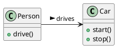
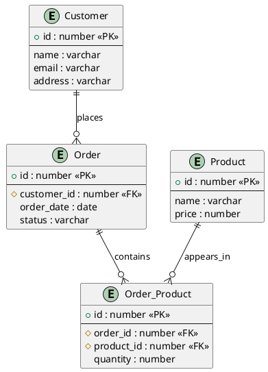

# TIL: 16th May 2023

- [TIL: 16th May 2023](#til-16th-may-2023)
  - [PlantUML](#plantuml)
    - [PlantUMLって何](#plantumlって何)
    - [PlantUMLの使い方を教えて](#plantumlの使い方を教えて)
    - [Javaの実行環境が入っているかを確認したい。Macで](#javaの実行環境が入っているかを確認したいmacで)
    - [PlantUMLでもうちょっと複雑なER図をサンプルでみてみたい。外部キーやインデックスとか張ってある例を出してみて](#plantumlでもうちょっと複雑なer図をサンプルでみてみたい外部キーやインデックスとか張ってある例を出してみて)
    - [以下の部分は何を意味しているの](#以下の部分は何を意味しているの)
    - [以下のWarningの意味を教えて](#以下のwarningの意味を教えて)

## PlantUML

### PlantUMLって何

PlantUMLは、UML（Unified Modeling Language）やその他の種類のダイアグラムを生成するためのテキストベースの言語です。UMLはソフトウェアの設計や設計の視覚化を支援するためのモデリング言語で、クラス図やシーケンス図などを作成するのによく使用されます。

PlantUMLでは、シンプルなテキスト形式でダイアグラムを記述することができます。そのテキストはPlantUMLソフトウェアによって解析され、対応するグラフィカルなダイアグラムが生成されます。

例えば、以下のテキストをPlantUMLに入力すると、2つのクラス（PersonとCar）とそれらの関係を表すクラス図が生成されます：



このように、PlantUMLはソフトウェアの設計やビジネスプロセスのモデリング、ドキュメンテーション作成などの目的で広く利用されています。

### PlantUMLの使い方を教えて

PlantUMLを使用するには、まずJava Runtime Environment（JRE）が必要です。なぜならPlantUMLはJavaで書かれており、Java環境で動作するからです。そのため、まずはJREがインストールされていることを確認しましょう。

次に、PlantUMLのjarファイルをダウンロードします。これは公式ウェブサイト（<http://plantuml.com/ja/）から行うことができます。>

PlantUMLをコマンドラインから使用するには、以下の手順を実行します：

まず、UMLを記述したテキストファイル（例：diagram.txt）を作成します。

次に、以下のコマンドを実行します：java -jar plantuml.jar diagram.txt（ここでplantuml.jarはダウンロードしたjarファイルのパスに置き換えてください）

このコマンドを実行すると、同じディレクトリにdiagram.pngという名前のPNGイメージが生成されます。このイメージはあなたが作成したUMLダイアグラムを表します。

ただし、PlantUMLはさまざまな統合開発環境（IDE）やテキストエディタ（例：Visual Studio Code、IntelliJ IDEA、Eclipseなど）に対応したプラグインとともに使用することもできます。これらのプラグインを使用すると、リアルタイムでダイアグラムのプレビューを見ることができ、作業がより簡単になります。

また、Webベースのツール（例：PlantText、PlantUML Online Serverなど）もあります。これらのツールを使用すると、ローカル環境に何もインストールすることなくPlantUMLを使うことができます。

PlantUMLの記述方法は多少複雑な部分もありますが、公式ウェブサイトには豊富なリファレンスと例がありますので、それらを参考にすると良いでしょう

### Javaの実行環境が入っているかを確認したい。Macで

Mac上でJavaの実行環境（Java Runtime Environment, JRE）がインストールされているかどうかを確認するには、ターミナルを開いて以下のコマンドを入力します：

```bash
java -version
```

このコマンドを実行すると、インストールされているJavaのバージョン情報が表示されます。たとえば、以下のような出力が表示されるかもしれません：

```bash
java version "1.8.0_241"
Java(TM) SE Runtime Environment (build 1.8.0_241-b07)
Java HotSpot(TM) 64-Bit Server VM (build 25.241-b07, mixed mode)
```

実際にはこんな感じでした：

```zsh
❯ java -version
java version "17.0.6" 2023-01-17 LTS
Java(TM) SE Runtime Environment (build 17.0.6+9-LTS-190)
Java HotSpot(TM) 64-Bit Server VM (build 17.0.6+9-LTS-190, mixed mode, sharing)
```

### PlantUMLでもうちょっと複雑なER図をサンプルでみてみたい。外部キーやインデックスとか張ってある例を出してみて

PlantUMLを使用して、外部キーやインデックスを持つより複雑なER図を作成することも可能です。ここでは例として、Customer、Order、Productの3つのエンティティを持つER図を作成してみましょう。

以下のPlantUMLコードは、これらのエンティティとそれらの関連を定義します：



このコードで生成されるER図では、Customerエンティティが複数のOrderエンティティを持ち、各Orderエンティティが複数のProductエンティティを持つという関連が表現されています。これは、Order_Productという中間テーブル（多対多の関連を可能にする）を通じて達成されています。

また、PKとFKはそれぞれ主キー（Primary Key）と外部キー（Foreign Key）を表す注釈です。これらは、エンティティ間の関連を強調し、ER図の理解を助けます。

なお、PlantUMLのER図では、より複雑な関連や制約を表現するためにさまざまな注釈や記法を使用することができます。詳細については公式ドキュメンテーションを参照してください。

### 以下の部分は何を意味しているの

```plantuml
customer ||--o{ order : places
order ||--o{ order_product : contains
product ||--o{ order_product : appears_in
```

この記述は、各エンティティ間の関連（リレーションシップ）を定義しています。具体的には以下のような意味合いになります。

customer ||--o{ order : places ： CustomerとOrderの間に一対多の関連があり、「Customer places Order」と読みます。つまり、一人の顧客が複数の注文を置くことができるという関係を表しています。

order ||--o{ order_product : contains ： OrderとOrder_Productの間に一対多の関連があり、「Order contains Order_Product」と読みます。つまり、一つの注文が複数の製品を含むことができる（Order_Productテーブルを介して）という関係を表しています。

product ||--o{ order_product : appears_in ： ProductとOrder_Productの間に一対多の関連があり、「Product appears in Order_Product」と読みます。つまり、一つの製品が複数の注文に登場することができる（Order_Productテーブルを介して）という関係を表しています。

||--o{の記号は一対多の関連を表しています。左側の||は"one"（一つ）を、右側のo{は"many"（多数）を表しています。また、コロン（:）の後に続くテキストはその関連を説明するラベルです。

### 以下のWarningの意味を教えて

```bash
MD033/no-inline-html: Inline HTML [Element: PK]markdownlintMD033
```

この警告は、Markdown Linter（特にmarkdownlintというツール）から出ているものです。

MD033/no-inline-html: Inline HTML [Element: PK]の意味は、「Markdownファイル内でHTMLを直接使用するのは推奨されません（Inline HTML）。該当するHTML要素は "PK" です」ということを示しています。

Markdownは軽量マークアップ言語で、HTMLよりもシンプルな記法で文書を書くことを目的としています。そのため、Markdownファイル内でHTMLを直接使用すると、そのシンプルさが損なわれ、ファイルが読みにくくなる可能性があると考えられています。さらに、一部のMarkdownレンダラーは、セキュリティ上の理由からHTMLの一部をレンダリングしないことがあります。

この警告を解消するためには、HTMLの代わりにMarkdownの記法を使用することを試みてみてください。ただし、Markdownが提供する記法だけでは表現できない場合、HTMLを使用せざるを得ないこともあります。その場合は、このルールを無視するか、設定から除外することも可能です。

なお、具体的な修正方法は、警告が出ている具体的なコードによりますので、そのコードを確認することが必要です。
